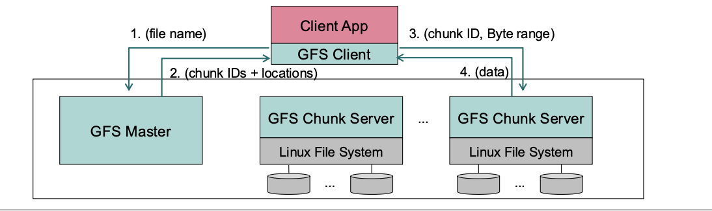
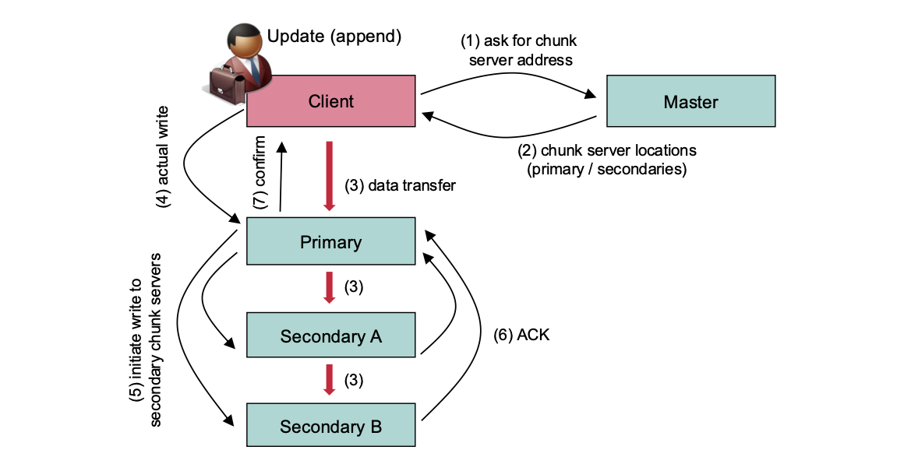
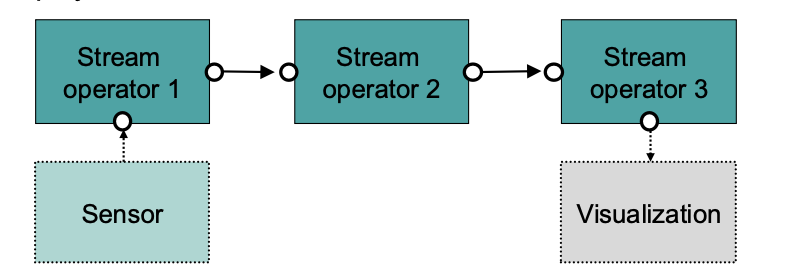
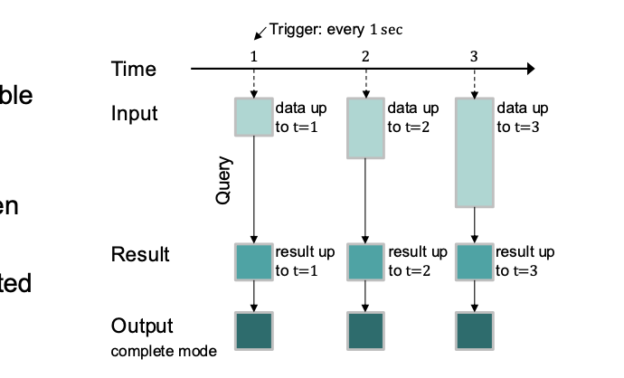

# Relation between NoSQL and Distribute Database
# GFS and Spanner
## GFS:
1. Designed for **batch processing** and **large-scale** data storage (e.g., for MapReduce, Bigtable)
2. Optimized for **high throughput** rather than low-latency transactions.
## Spanner
1. Built for **real-time**, transactional workloads with synchronous replication.
2. Spanner is a relational database with SQL support, unlike GFS (which is a file system)
# 4. Distributed Data Infrastructures and Event-Driven Architectures
## Goal
collection, integration, management, processing, and **analysis** of data.
## 1. Data Management in the Cloud
### 1.1. Distributed File Systems ...
1. They take the particularities of **Cloud infrastructures** into account: commodity hardware with a large number of servers 
2. Consequently, the file system needs to be **robust** against hardware failures
3. **Workload**: mainly two types of reads and a special write operation **Large streaming reads** (≫ 100 KB, rather several MB) **Small random reads**。 Mutation: **append** data to files rather than updating them. Once written, files are usually kept unchanged (immutable data)
### 1.2. Google File System (GFS)
1. he Google File System (GFS) is an **example** of such a Distributed File System tailored to **Cloud data management**
2. **Snapshot** (create a replica of a file or a complete directory tree) system operation. **Record append** (concurrent append operations to the same file while guaranteeing consistency) = user operation
3. Google File System (GFS) is **not a database**. It's a distributed file system. **store** huge amounts of data **across** many machines.
4. It provides a **storage layer** for data — like a **big shared disk** across a cluster.
5. GFS is the **foundation**. On top of GFS, you can build **data-processing systems** like MapReduce, Bigtable, or Spanner.
6. Bigtable (Google’s NoSQL DB) or Spanner (Google’s relational DB) are databases that run on top of GFS.
#### 1.2.1 GFS Architecture
1. a GFS **Cluster** consists of − a single **master** server(**Replication**), several **chunk servers**
2. Files are **subdivided** into chunks of fixed size
3. **Triplication**:chunks are stored at least three times
#### 1.2.2 GFS: Data Access

#### 1.2.3 GFS: Consistency ...
1.  Updates (= append) first applied at **primary**, later on **propagated** to secondary chunk servers (all initiated by the client)
2. Changes **serialized** by primary
3. **Consistent**: all clients see the same data, independently of the chunk server (replica) they access 
4. **Defined**: consistent state and append operation has been **atomic**
#### 1.2.4 GFS: Update Operations

## 2. Databases in the Cloud: Google Spanner
1. Google Spanner (now: Cloud Spanner): example of a **NewSQL** database
2. Spanner is built on a different **distributed storage** infrastructure designed for **low-latency**, **globally distributed**, and **strongly consistent** database operations.
### 2.1 Google Spanner: Data Organization
### 2.1 Google Spanner: Replication
### 2.3 Google Spanner: Transactions

## 3. Big Data Processing
### 3.1 MapReduce: The Problem
#### 3.1.1 Basic Map/Reduce pattern
#### 3.1.2 MapReduce: Main objective
#### 3.1.3 The map and the reduce Function
#### 3.1.4 MapReduce: Formal Description
#### 3.1.5 Shuffle

### 3.2 Apache Spark
#### 3.2.1 Resilient Distributed Datasets in Apache Spark
#### 3.2.2 Apache Spark: Transformations on RDDs
#### 3.2.3 Apache Spark: Actions on RDDs
#### 3.2.4 Apache Spark: Persistence and Partitioning
#### 3.2.5 Apache Spark: Architecture
#### 3.2.6 The Apache Spark Ecosystem

## 4. Data Stream Processing
### 4.1 Data Stream
1. Sensors Data Stream Processing Visualization
2. Once data starts flowing in from sensors, we need a series of **well-defined operators to make sense of it** — and those operators are typically smart (stateful) and predictable (deterministic).
#### 4.1.1 Sliding Windows
1. Stream operators **process** data stream elements in sliding windows
2. **Collect** stream elements within a certain period of time
3. Assume some **correlation** if data stream elements co-exist in the same window
#### 4.1.2 Stream Applications
1. Data stream applications usually encompass **several** data stream operators
2. Deployed on nodes **distributed** within a network

#### 4.1.3 Data Stream Processing vs. Continuous Queries ...
1. **Traditional** model of databases and database queries: **Data: persistent. Queries: transient**
2. Data **Streams**: model is put “upside down”- **Queries:persistent Data: transient** (data streams “float” through the system)
#### 4.1.4 Lambda Architecture ...
1. **Architecture for data streams** that takes **both batch and stream processing** into account 
2. Support different workloads and use cases − Combines batch queries (e.g. MapReduce or Spark) and real-time (continuous) queries
3. All data entering the system is **dispatched** to **both** the batch layer and the speed layer for processing.
4. The **batch layer** has two functions: i. It **manages** the master dataset. This is an immutable, append-only set of raw data items. ii. It pre-computes different batch views (for different applications).
5. The **serving** layer indexes the batch views to support **ad-hoc**queries(spontaneous) with low-latency.
6. The **speed** layer only contains the **most recent data** (can be deleted as soon as data has been processed by the batch and service layers). It serves **real-time queries** with very low latency.
#### 4.1.5 Kappa Architecture
1. Simplification of the Lambda Architecture **Without batch layer**
2. **All** incoming data go through the **speed** layer The **serving** layer only contains **results** of the speed layer

### How to choose
1. If your system needs high **accuracy**, **complex** analytics, and can handle more **complexity**, go **Lambda**.
2. If you want a **simpler**, **real-time-focused** architecture and can handle analytics in streaming mode, go Kappa.

### 4.2 Data Stream Processing: Spark Streaming ...
1. Spark Streaming adds data stream **processing** capabilities on top of **Apache Spark**
2. operates in **batch** mode: incoming stream elements continuously appended to an **unbounded table**.
3. this table (or the increment) is considered an **RDD** and is **subject** to Spark transformations and actions
4. Spark Streaming runs this **query** at **dedicated** points in time on the **current** instance of the unbounded input **table**
5. **Complete Mode**: the entire updated result table is written each time to external storage. **Append Mode**: Only new rows appended to the result table since the last trigger are written to external storage. **Update Mode**: Only the rows that were updated in the result table since the last trigger are written to external storage

### 4.3 Data Stream Processing: Apache Storm ...
1. In contrast to Apache Spark, Apache Storm (https://storm.apache.org/) follows a **one-data-at-a-time** programming model
2. Newly arriving data stream elements are **immediately processed**
3. Storm consists of two types of elements **Spouts**: data **sources** which emit one or several data streams 。**Bolts**: **processing** elements: they consume one or several data streams and emit one or several streams
4. Storm applications are defined as **directed acyclic graphs (DAGs)** Spouts and bolts are the nodes in the graph (spouts are the sources)  **Edges** in the graph are named **data streams**
### 4.4 Data Stream Processing: Apache Flink
1. Flink (https://flink.apache.org/) supports **batch processing** (via **DataSet** API) and **continuous** one-data-at-a-time stream processing (via **DataStream** API)
### How to choose
Use **Storm** if: **ultra-low latency** per event is critical and you’re comfortable with a more low-level, granular event-processing model.

✅ Use **Spark Streaming** if: you want ease of use, strong **ecosystem** support, micro-batch is fine, and you want **unified batch + streaming analytics.**

### 4.5 Spark Streaming vs Structured Streaming

## 5. Message-oriented Middleware
### 5.1 Message-Oriented Middleware (MOM)
#### 5.1.1 Asynchronous Procedure and Method Calls ...
### 5.2 Different variants of MOM ...
### 5.3 Point-to-Point connection (PTP)
### 5.4 Publish-and-Subscribe (Pub/Sub)
#### 5.4.1 Publish-and-Subscribe: Basic Architecture
#### 5.4.2 Publish-and-Subscribe:  Basic Interaction Model
#### 5.4.3 Example: MQTT (Message Queuing Telemetry Transport)
#### 5.4.4 Publish-and-Subscribe: Variants of Interactions (1)
#### 5.4.5 Topics-based Publish/Subscribe
