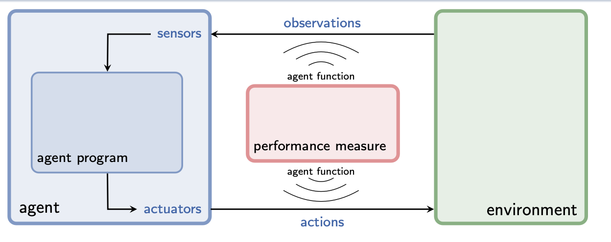
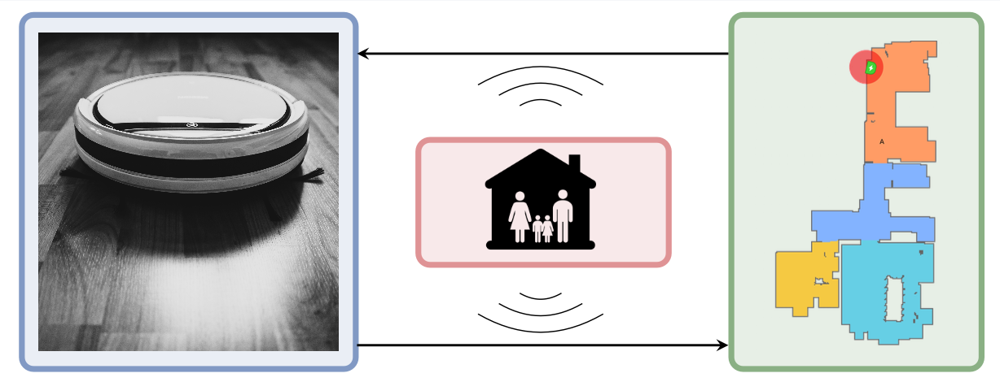
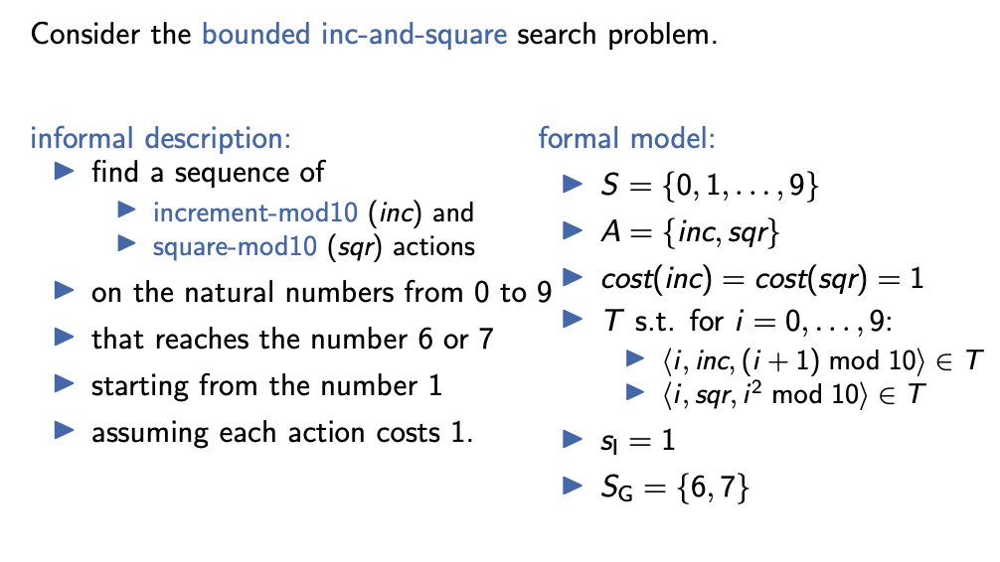
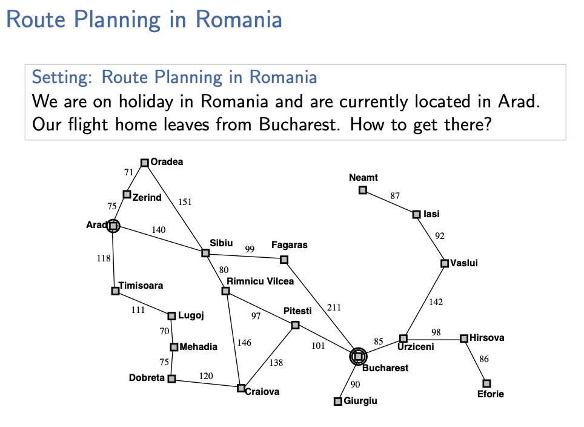
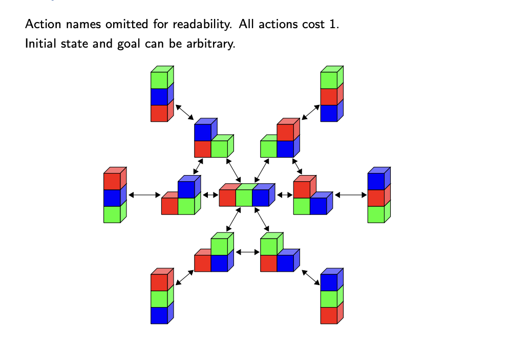
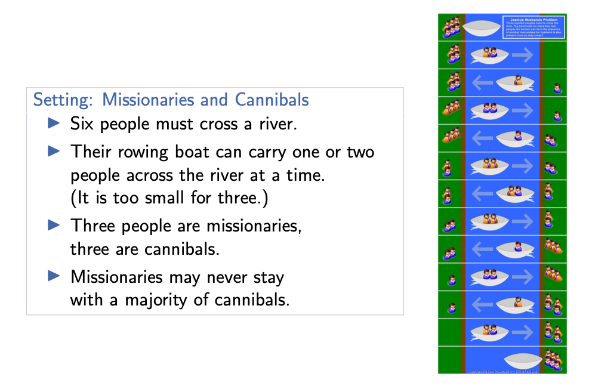

# What is AI
1. **Thinking like human:** roughly corresponds to cognitive science and cognitive neuroscience
2. **Acting like human:** systems like LaMDA and ChatGPT would likely pass the **Turing test**
3. **Thinking Rationally:** yield **correct** conclusions given correct premises: AI planner computing a sequence of actions to achieve a goal with minimum cost.
4. **acting rationally**: “**doing the right thing**” the right thing: maximize utility given available information does **not necessarily require “thought**” (e.g., reflexes)

# Introduction: Rational Agents
## 1. Systematic AI Framework
1. sensors: physical entities that allow the agent to observe 
2. observation: data perceived by the agent’s sensors
3. actuators: physical entities that allow the agent to act
4. action: abstract concept that affects the state of the environment

### 1.1 as agent program:
1. internal representation
2. specifics possibly unknown to outside
3. takes observation as input
4. outputs an action
5. computed on physical machine (the agent architecture)
### 1.2 as agent function: 
1. external characterization
2. maps sequence of observations to (probability distribution over) actions
3. abstract mathematical formalization
### example

1. observations: current location, dirt level of current room, presence of humans, battery charge
2. actions: move-to-next-room, move-to-base, vacuum, wait

## Rationality
**What is the right agent function?**  
rationality of an agent depends on **performance measure** (often: utility, reward, cost) and environment  
**Perfect Rationality**  
4. for each possible observation sequence
5. select an action which **maximizes expected value** of future performance
7. given available information on observation history and environment
### Perfect Rationality of Our Vacuum Agent
#### why
consider performance measure:  
1. −1 utility for each dirty room in each step  
consider environment:  
2. actions and observations reliable  
3. world only changes through actions of the agent  

**our vacuum agent is not perfectly rational**
### Rationality: Discussion
**perfect rationality ̸= omniscience**  
1. incomplete information (due to limited observations) reduces achievable utility  

**perfect rationality ̸= perfect prediction of future**  
1. uncertain behavior of environment (e.g., stochastic action effects) reduces achievable utility  

**perfect rationality is rarely achievable**  
1. limited computational power ⇝ bounded rationality  

# State-Space Search: State Spaces
## Classification
### State-Space Search  
environment:  
▶ static vs. dynamic  
▶ deterministic vs. nondeterministic vs. stochastic   
▶ fully observable vs. partially observable  
▶ discrete vs. continuous  
▶ single-agent vs. multi-agent  
problem solving method:  
▶ problem-specific vs. general vs. learning  

### Informal Description
State-space search problems are among the “simplest” and most important classes of AI problems.  
objective of the agent:  
▶ apply a sequence of actions  
▶ that reaches a goal state  
▶ from a given initial state  
performance measure: minimize total action cost  

## Formalization
### State Spaces
**Definition (state space)**  
A state space or transition system is a 6-tuple S = ⟨S,A,cost,T,sI,SG⟩ with  
▶ finite set of states S  
▶ finite set of actions A  
▶ action costs cost : A → R+0  
▶ transitionrelationT ⊆S×A×S thatis deterministic in ⟨s,a⟩ (see next slide)  
▶ initial state sI ∈ S  
▶ set of goal states SG ⊆ S  
### State Spaces: Terminology & Notation
**Definition (transition, deterministic)**  
Let S = ⟨S,A,cost,T,sI,SG⟩ be a state space.  
The triples ⟨s, a, s′⟩ ∈ T are called (state) transitions.  
We say S has the transition ⟨s,a,s′⟩ if ⟨s,a,s′⟩ ∈ T.   
We write this as s→−a s′,ors→s′ when a does not matter.  
Transitions are deterministic in ⟨s,a⟩: it is forbidden to have boths→−a s1 ands→−a s2 withs1 ̸=s2.  

### State Space: Running Example
**Consider the bounded inc-and-square search problem.**

### State Spaces: More Terminology (1)
We use common terminology from graph theory.  
**Definition (predecessor, successor, applicable action)**  
Let S = ⟨S,A,cost,T,sI,SG⟩ be a state space.   
Let s,s′ ∈ S be states with s → s′.  
▶ s is a predecessor of s′   
▶ s′ is a successor of s  
If s →−a s′, then action a is applicable in s.  

**Definition (path)**  
Let S = ⟨S,A,cost,T,sI,SG⟩ be a state space.  
Let s0,...,sn ∈ S be states and a1,...,an ∈ A be actions  
a1 an such that s0 −→ s1, ..., s(n−1) −→ sn.  
▶ π = ⟨a1,...,an⟩ is a path from s0 to sn   
▶ lengthofπ: |π|=n  
▶ cost of π: cost(π) = Pni =1 cost(ai )  

**Definition (reachable, solution, optimal)**  
Let S = ⟨S,A,cost,T,sI,SG⟩ be a state space.  
▶ state s is reachable if a path from sI to s exists  
▶ paths from s ∈ S to some state sG ∈ SG are solutions for/from s  
▶ solutions for sI are called solutions for S  
▶ optimal solutions (for s) have minimal costs among all solutions (for s)  

## State-Space Search

### State-Space Search
State-Space Search  
State-space search is the algorithmic problem of finding solutions in state spaces or proving that no solution exists.  
In optimal state-space search, only optimal solutions may be returned.  

# State-Space Search: Representation of State Spaces
## Explicit Graphs
**State Spaces as Explicit Graphs**  
represent state spaces as explicit directed graphs:   
▶ vertices = states  
▶ directed arcs = transitions  
⇝ represented as adjacency list or adjacency matrix  

**discussion:**  
▶ impossible for large state spaces (too much space required)  
▶ if spaces small enough for explicit representations, solutions easy to compute: Dijkstra’s algorithm O(|S|log|S|+|T|)  
▶ interesting for time-critical all-pairs-shortest-path queries (examples: route planning, path planning in video games)  

## Declarative Representations
**State Spaces with Declarative Representations**  
represent state spaces declaratively:  
▶ compact description of state space as input to algorithms  
⇝ state spaces exponentially larger than the input   
▶ algorithms directly operate on compact description  
⇝ allows automatic reasoning about problem: reformulation, simplification, abstraction, etc.  

## Black Box
**State Spaces as Black Boxes**  
Define an abstract interface for state spaces. For state space S = ⟨S,A,cost,T,sI,SG⟩  
we need these methods:  
▶ init(): generate initial state  
result: state sI  
▶ is goal(s): test if s is a goal state  
result: true if s ∈ SG; false otherwise  
▶ succ(s): generate applicable actions and successors of s  
result: sequence of pairs ⟨a,s′⟩ with s →−a s′  
▶ cost(a): gives cost of action a result: cost(a) (∈ N0)  

# State-Space Search: Examples of State Spaces
## Route Planning in Romania

**State Space Route Planning in Romania**   
▶ states S : {arad, bucharest, craiova, . . . , zerind}  
▶ actions A: movec ,c ′ for any two cities c and  c ′  
connected by a single road segment  
▶ action costs cost: see figure,  
e.g., cost(moveiasi,vaslui) = 92  
▶ transitions T: s →−a s′ iff a = moves,s′  
▶ initial state: sI = arad  
▶ goal states: SG = {bucharest}  

## Blocks World

**State Space Blocks World**  
states S:  
partitions of {1, 2, . . . , n} into nonempty ordered lists  
example n = 3:  
▶ {⟨1,2,3⟩},{⟨1,3,2⟩},{⟨2,1,3⟩},  
{⟨2, 3, 1⟩}, {⟨3, 1, 2⟩}, {⟨3, 2, 1⟩}  
▶ {⟨1,2⟩,⟨3⟩},{⟨2,1⟩,⟨3⟩},{⟨1,3⟩,⟨2⟩},  
{⟨3, 1⟩, ⟨2⟩}, {⟨2, 3⟩, ⟨1⟩}, {⟨3, 2⟩, ⟨1⟩}  
▶ {⟨1⟩,⟨2⟩,⟨3⟩}  

**state space ⟨S,A,cost,T,sI,SG⟩ for blocks world with n blocks**  
State Space Blocks World  
actions A:  
▶ {moveu,v | u,v ∈ {1,...,n} with u ̸= v}  
▶ move block u onto block v.  
▶ both must be uppermost blocks in their towers  
▶ {to-tableu | u ∈ {1,...,n}}  
▶ move block u onto the table (⇝ forming a new tower)   
▶ must be uppermost block in its tower  
action costs cost:  
cost(a) = 1 for all actions a ∈ A  

**transitions:**  
▶ transition s →−a s′ with a = moveu,v exists iff   
▶ s ={⟨b1,...,bk,u⟩,⟨c1,...,cm,v⟩}∪X and    
▶ if k > 0: s′ ={⟨b1,...,bk⟩,⟨c1,...,cm,v,u⟩}∪X   
▶ ifk=0: s′ ={⟨c1,...,cm,v,u⟩}∪X  
▶ transition s →−a s′ with a = to-tableu exists iff  
▶ s={⟨b1,...,bk,u⟩}∪ X with k > 0 and   
▶ s′ ={⟨b1,...,bk⟩,⟨u⟩}∪X   

## Missionaries and Cannibals

State Space Missionaries and Cannibals  
states S:  
triples of numbers ⟨m, c, b⟩ ∈ {0, 1, 2, 3} × {0, 1, 2, 3} × {0, 1}:  
▶ number of missionaries m,   
▶ cannibals c and  
▶ boats b  
on the left river bank  
initial state: sI = ⟨3, 3, 1⟩  
goal: SG = {⟨0, 0, 0⟩, ⟨0, 0, 1⟩}  

# State-Space Search: Data Structures for Search Algorithms
