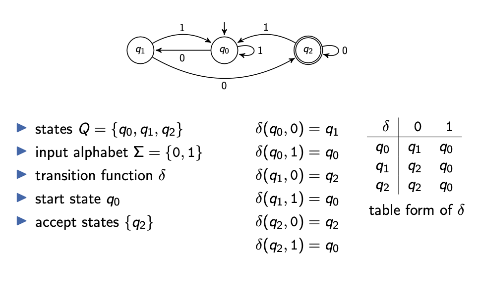
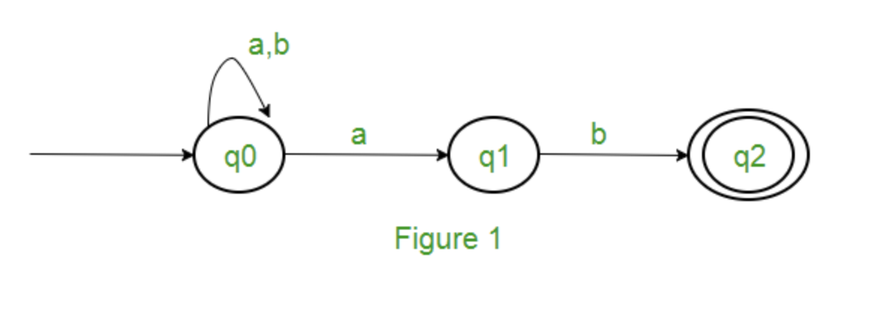
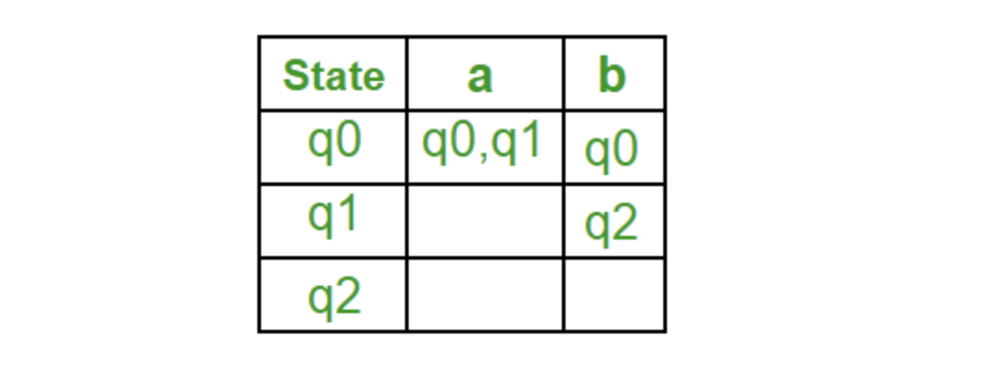
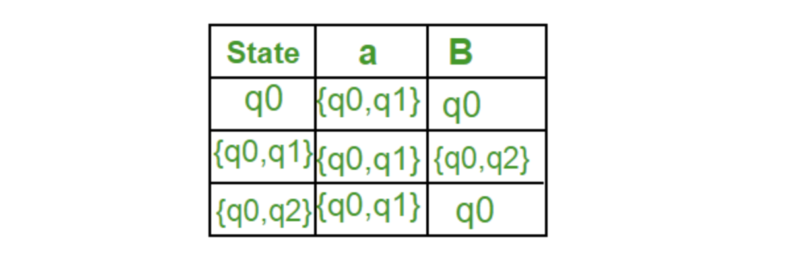
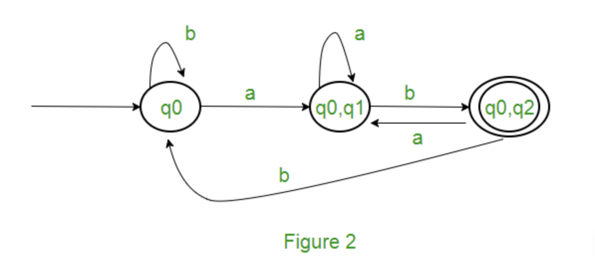
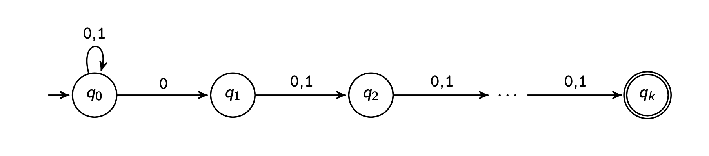
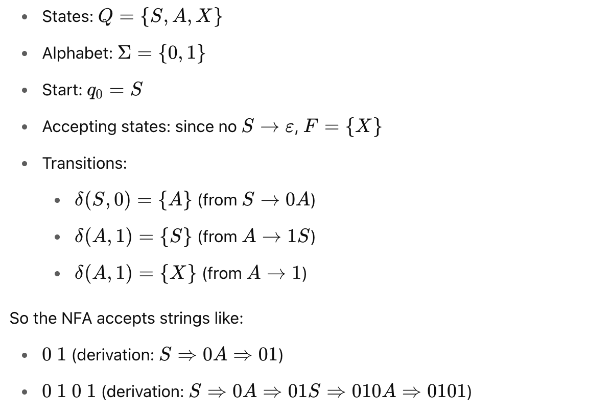

# A2
## A2.1 - Set 
1. key: unordered, once
2. type: explict and implict
    1. explict: {1,2,3}
    2. implict: {x|1<x<3}
3. cardinality: |M| = number of elements in M
4. subset: A⊆B
5. strict subset: A⊂B
6. power set P(M): set of all subsets of M

## A2.2 - Tuples
**odered** not only once sequence: (a1,a2,a3)
components: objects contained in tuples

## A2.3 - Cartesian Product
M1 ×···× Mn = {⟨o1,...,on⟩|o1 ∈ M1,...,on ∈ Mn}.
**n-ary relation R** is a subset over the sets M1,...,Mn = R ⊆ M1×···×Mn.

## A2.4 - Functions
(total) function f : D → C
maps **every** value of its domain D
to exactly **one** value of its codomain C.

partial function f : X →p Y
f does not map x ∈ X to any value in Y, then f is undefined for x.

# A3 Proofs & Proof Strategies
## A3.1 - Statement
1. consists of a set of **preconditions** and a set of **conclusions**.
2. The statement is true if the conclusions are true whenever the preconditions are true or the precondition is false.
3. in logic is true: If 4 is a prime number then 2·3 = 4.

## A3.2 - Mathematical Proof
a sequence of **logical steps** starting with one set of statements
that comes to the conlusion that some statement must be true.

1. **axioms**: statements that are assumed to always be true in the current context
2. **theorems and lemmas:** statements that were already proven 
    1. lemma: an intermediate tool
    2. theorem: itself a relevant result
3. **premises**: assumptions we make to see what consequences they have

## A3.3 - Direct Proof
For all sets A, B, C: A ∩(B ∪ C) = ( A ∩ B)∪( A ∩ C ).  

Proof.  
Alternative:  
A ∩ (B ∪ C ) = {x | x ∈ A and x ∈ B ∪ C }  
= {x | x ∈ A and (x ∈ B or x ∈ C)}  
= {x | (x ∈ A and x ∈ B) or (x ∈ A and x ∈ C)} = {x | x ∈ A ∩ B or x ∈ A ∩ C }  
= (A ∩ B) ∪ ( A ∩ C )  

## A3.4 - Indirect Proof
Let A and B be sets. If A \ B = ∅ then A ⊆ B.  

We prove the theorem **by contradiction.**  
Assume that there are sets A and B with A \ B = ∅ and A  ̸⊆ B. Let A and B be such sets.  
Since A  ̸⊆ B there is some x ∈ A such that x ̸∈ B.  
For this x it holds that x ∈ A \ B.  
This is a contradiction to A \ B = ∅.  
We conclude that the assumption was false and thus the theorem is true.  

## A3.5 - Structural Induction
Proof of statement for all elements of an inductively defined set  
1. basis: proof of the statement for the **basic elements**
2. induction hypothesis (IH):
suppose that the statement is true for some elements M
3. inductive step: proof of the statement for elements constructed by applying a **construction rule **to M (one inductive step for each construction rule)

For all binary trees B: inner(B) = leaves(B) − 1.  

**Proof**  
induction basis:  
inner(□) = 0 = 1 − 1 = leaves(□) − 1  
⇝ statement is true for base case  

induction hypothesis:  
to prove that the statement is true for a composite tree ⟨L,⃝,R⟩, we may use that it is true for the subtrees L and R.  
inductive step for B = ⟨L, ⃝, R ⟩: inner(B) = inner(L) + inner(R) + 1
IH
= (leaves(L) − 1) + (leaves(R) − 1) + 1  
= leaves(L) + leaves(R) − 1 = leaves(B) − 1  

# B1. Formal Languages & Grammars
## B1.1 - Decision Problems: Given-Question Form
Given: possible input  
Question: does the given input have a certain property?  
## B1.2 - Alphabets and Formal Languages
Definition (Alphabets, Words and Formal Languages)  

An **alphabet Σ** is a finite non-empty **set** of symbols.  
A **word** over Σ is a finite **sequence** of elements from Σ.  
The **empty word** (the empty sequence of elements) is denoted by **ε**. **Σ∗** denotes the **set of all words over Σ**.  
**Σ+ (= Σ∗ \ {ε})** denotes the set of all non-empty words over Σ.  
We write **|w|** for the **length** of a word w.  
A **formal language** (over alphabet Σ) is a **subset of Σ∗**.  

## B1.3 - Languages: Examples
S1 = {a,aa,aaa,aaaa,...} = {a}+  
S2 = Σ∗  
S3 = {anbn | n ≥ 0} = {ε,ab,aabb,aaabbb,...}  
S4 ={ε}  
S5 = ∅  
S6 = {w ∈ Σ∗ | w contains twice as many as as bs} = {ε,aab,aba,baa,...}  

## B1.4 - Grammar
Variables V = {S, X, Y}   
Alphabet Σ = {a, b, c}.   
**Production rules:**
S → ε X → aX  
X → 0Y1 | XY  

A grammar is a **4-tuple ⟨V , Σ, R, S⟩** with:  
1. V finite set of **variables** (nonterminal symbols)  
2. Σ finite alphabet of **terminal symbols** with V ∩ Σ = ∅ 
3. R ⊆ **(V∪Σ)∗V(V∪Σ)∗×(V∪Σ)∗** finite set of rules 
4. S ∈ V start variable

## B1.5 - Derivations
Let⟨V,Σ,R,S⟩ be a grammar. A word v ∈ (V∪Σ)∗ can be **derived** from word u ∈ (V∪Σ)+ (written as u⇒v)if  
1. u=xyz,v=xy′z with x,z∈(V∪Σ)∗ and  
2. there is a rule **y → y′ ∈ R**.  
We write: u ⇒∗ v if v can be derived from u in finitely many steps (i. e., by using n derivations for n ∈ N0).

## B1.6 - Languages
The language generated by a grammar G = ⟨V,Σ,P,S⟩  
**L(G)={w ∈ Σ∗ |S ⇒∗ w}**  
is the **set of all words** from Σ∗ that can be derived from S with **finitely** many rule applications.

## B1.7 - Chomsky hierarchy
1. Every **grammar** is of type 0 (**all rules allowed**).  
2. Grammar is of type 1 (**context-sensitive**)  
3. if all rules are of the form **αBγ → αβγ**. with **B ∈ V and α,γ ∈ (V∪Σ)∗ and β ∈ (V∪Σ)+**
4. Grammar is of type 2 (**context-free**) if all rules are of the form **A → w**, where **A ∈ V and w ∈ (V ∪ Σ)+**.
5. Grammar is of type 3 (regular) if all rules are of the form A → w, where A ∈ V and w ∈ Σ ∪ Σ V .

## B1.8 - Type 0–3 Languages
A languageL ⊆ Σ∗ is of type0 (type1,type2,type3)  
if there exists a type-0 (type-1, type-2, type-3) **grammar G with L(G) = L.**

## B1.9 - Type 3 language
1. Type-3 grammars generate the **regular languages**. Such a grammar restricts its rules to a **single nonterminal on the left-hand side** and a right-hand side consisting of a single terminal, possibly followed by a single nonterminal, in which case the grammar is right regular. 
2. Alternatively, all the rules can have their right-hand sides consist of a single terminal, possibly preceded by a single nonterminal (left regular). These generate the same languages. However, 
3. **if left-regular rules and right-regular rules are combined, the language need no longer be regular.** Mixing both kinds of rules allows for patterns and dependencies that are more powerful than what a finite automaton can handle (like palindromes or center-sensitive structures), which go beyond regular languages.
4. The rule S → ε is also allowed here if S does not appear on the right side of any rule. These languages are exactly all languages that can be decided by a **finite-state automaton**. 
5. Additionally, this family of formal languages can be obtained by regular expressions. Regular languages are commonly used to define search patterns and the lexical structure of programming languages.

## B1.10 - Type 2 language
1. Type-2 grammars generate the **context-free languages**. These are defined by rules of the form A → α with  A being a nonterminal and 
**α being a *string* of terminals and/or nonterminals.**
2. These languages are exactly all languages that can be recognized by a **non-deterministic pushdown automaton**. 

## B1.11 - Type 1 language
1. Type-1 grammars generate **context-sensitive languages**. These grammars have rules of the form **αAβ → αγβ with A a nonterminal and α,β and γ strings of terminals and/or nonterminals.** 
2. The strings α and β may be empty, but **γ must be nonempty**. The rule **S → ϵ is allowed if S does not appear on the right side of any rule.** 
3. The languages described by these grammars are exactly all languages that can be recognized by a **linear bounded automaton** (a nondeterministic Turing machine whose tape is bounded by a constant times the length of the input.)
# B2. - Regular Grammars: ε-Rules
## B2.1 - Regular Grammars
A regular grammar is a **4-tuple ⟨V , Σ, R, S⟩** with
1. V finite set of **variables** (nonterminal symbols)
2. Σ finite alphabet of **terminal** symbols with V ∩ Σ = ∅
3. **R ⊆ (V × (Σ ∪ ΣV)) ∪ {⟨S,ε⟩}** finite set of rules
4. if S → ε ∈ R,there is no X ∈ V,y ∈ Σ with X → yS ∈ R 
5. S ∈ V start variable.
6. example: A -> aB, A -> a, A -> ε

## B2.2 - Abstract
1. a regular grammar **is a grammar that is right-regular or left-regular**. While their exact definition varies from textbook to textbook, they all require that all production rules **have at most one non-terminal symbol** that **symbol is either always at the end or always at the start of the rule's right-hand side.**
Every regular grammar describes a regular language.

## B2.3 - Strictly regular grammars
1. Right-regular grammar : A -> a or A -> aB or A -> ε
2. Regular Languages : A -> a or A -> Ba or A -> ε
A language is regular if it is generated by some regular grammar.  
A language L ⊆ Σ∗ is regular  
if there exists a regular grammar G with **L(G ) = L**.

## B2.4 - R ⊆V ×(Σ∪ΣV ∪{ε})
We are going to show that every grammar with rules generates a regular language.
 
1. The proof will be **constructive**, i. e. it will tell us how to construct a regular grammar for a language that is given by such a more general grammar.
2. Two steps:  
    2.1 Eliminate the start variable from the right-hand side of rules.  
    2.2 Eliminate forbidden occurrences of ε.

## B2.5 - Start Variable in Right-Hand Side of Rules
1. For every grammar G = ⟨V,Σ,R,S⟩ there is a grammar G′ = ⟨V′,Σ,R′,S⟩ with rules **R′⊆(V′∪Σ)∗V′(V′∪Σ)∗×(V′\{S}∪Σ)∗** suchthat L(G) = L(G′). with rulw about sineyajadaj
2. A -> aSb to A -> aS'b. S -> Sa to S -> S'a, S -> Sa to S' -> S'a
3. so that S no longer appears on the right hand side of any rule.

## B2.6 - Eliminating epsilon Rules
### 1. Check that the start symbol does not occur on any right-hand side
Because if it does, and we remove the ε-production S → ε, we might **lose the ability to generate the empty word** in contexts where it was needed.
### 2. Determine nullable variables (those that can derive ε)
1. Start with variables that have a rule A → ε ⇒ A ∈ Vₑ
2. Add variables that can produce ε indirectly
### 3. Eliminate all ε-productions, except possibly from the start symbol if it was needed to produce ε.
### 4. Modify the grammar to preserve the language

## B2.7 - transforming a special kind of context-free grammar into a regular grammar
1. **Goal:** for every grammer G = ⟨V,Σ,R,S⟩ with rules in the restricted form: **R ⊆ V × ( Σ ∪ Σ V ∪ {ε})** : S -> aA, A -> ε. there exists a regular grammar G'' such that: L(G) = L(G'')
2. **ε-Production Elimination:** 
3. Now we fully eliminate ε-productions, except possibly S → ε, and simulate them using new rules.

# B3.  Finite Automata
We will not consider automata that run forever but that **process a finite input sequence and then classify it as accepted or not.**

## B3.1 - Deterministic Finite Automaton
### 1. Definition (Deterministic Finite Automata)  
A deterministic finite automaton (DFA) is a **5-tuple M = ⟨Q,Σ,δ,q0,F⟩** where  
1. Q is the finite set of **states**  
2. Σ is the **input alphabet**  
3. δ:Q×Σ→Q is the **transition function**  
4. q0 ∈ Q is the start state  
5. F ⊆ Q is the set of accept states (or final states)  
6. a DFA accepts a word if its computation terminates in an accept state.
### 2. DFA: Recognized Language
Let M be a deterministic finite automaton. The language recognized by M is defined as **L(M) = {w ∈ Σ∗ | w is accepted by M}**.

## B3.2 - NFA Nondeterministic Finite Automata
When a DFA is in a specific state and reads an input symbol, we know what the next state will be. For a given input, the entire computation is determined. **ε-transitions are illegal in a Deterministic Finite Automaton (DFA).**
### 1. Definition (Nondeterministic Finite Automata)
δ : **Q × (Σ ∪ {ε}) → P(Q)** is the transition function (mapping to the power set of Q)

# B4 Finite Automata: Characterization
## B4.1 - DFAs are No More Powerful than NFAs
### 1. Every language recognized by a DFA is also recognized by an NFA.
1. We can transform a DFA into an NFA by replacing every transition δ(q, a) = q′ with δ(q, a) = {q′}.
### 2. Every language recognized by an NFA is also recognized by a DFA.
Proof.  
For every NFA M = ⟨Q,Σ,δ,q0,F⟩ we can construct a DFA M′ = ⟨Q′,Σ,δ′,q0′ ,F′⟩ with L(M) = L(M′). Here M′ is defined as follows:  
▶ Q′ := P(Q) (the power set of Q)  
▶ q0′ :=E(q0)  
▶ F ′ := {Q ⊆ Q | Q ∩ F ̸= ∅}  
▶ For all Q ∈ Q′: δ′(Q,a) := Sq ∈ Q Sq′∈δ(q,a) E(q′)  

## B4.2 - Conversion from NFA to DFA
**Example: Consider the following NFA shown in Figure 1.**

Transition Function of NFA

Result:

## B4.3 - NFAs are More Compact than DFAs
Example  
For k ≥ 1 consider the language  
Lk = {w ∈ {0,1}∗ | |w| ≥ k and the k-th last symbol of w is 0}.  
The language Lk can be recognized by an NFA with k + 1 states:  

There is no DFA with less than 2k states that recognizes Lk

## B4.3 - Finite Automata vs. Regular Languages
### 1. Every language recognized by a DFA is regular (type 3).
### 2. For every regular grammar G there is an NFA M with L(G) = L(M).
**example:**  
Let the regular grammar be:  
V={S,A}  
Σ={0,1}  
R={S→0A, A→1S, A→1}  
S: start symbol  
Now, construct NFA:  

