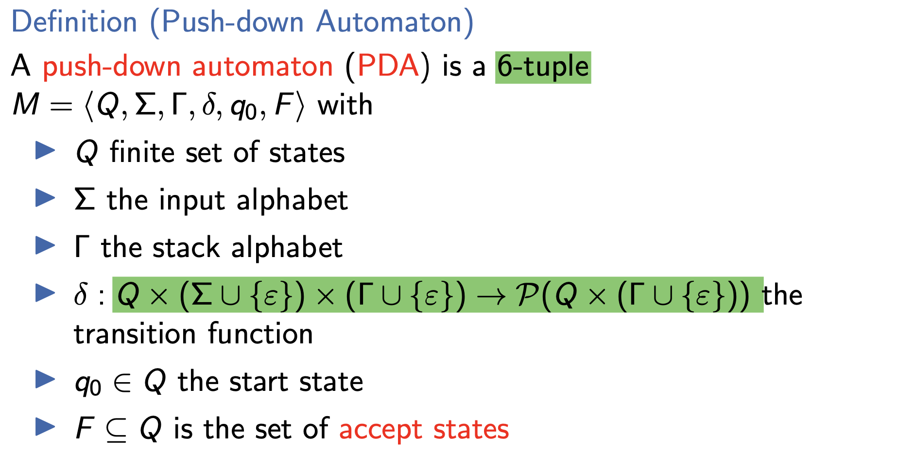

# A2
## A2.1 - Set 
1. key: unordered, once
2. type: explict and implict
    1. explict: {1,2,3}
    2. implict: {x|1<x<3}
3. cardinality: |M| = number of elements in M
4. subset: A⊆B
5. strict subset: A⊂B
6. power set P(M): set of all subsets of M

## A2.2 - Tuples
**odered** not only once sequence: (a1,a2,a3)
components: objects contained in tuples

## A2.3 - Cartesian Product
M1 ×···× Mn = {⟨o1,...,on⟩|o1 ∈ M1,...,on ∈ Mn}.
**n-ary relation R** is a subset over the sets M1,...,Mn = R ⊆ M1×···×Mn.

## A2.4 - Functions
(total) function f : D → C
maps **every** value of its domain D
to exactly **one** value of its codomain C.

partial function f : X →p Y
f does not map x ∈ X to any value in Y, then f is undefined for x.

# A3 Proofs & Proof Strategies
## A3.1 - Statement
1. consists of a set of **preconditions** and a set of **conclusions**.
2. The statement is true if the conclusions are true whenever the preconditions are true or the precondition is false.
3. in logic is true: If 4 is a prime number then 2·3 = 4.

## A3.2 - Mathematical Proof
a sequence of **logical steps** starting with one set of statements
that comes to the conlusion that some statement must be true.

1. **axioms**: statements that are assumed to always be true in the current context
2. **theorems and lemmas:** statements that were already proven 
    1. lemma: an intermediate tool
    2. theorem: itself a relevant result
3. **premises**: assumptions we make to see what consequences they have

## A3.3 - Direct Proof
For all sets A, B, C: A ∩(B ∪ C) = ( A ∩ B)∪( A ∩ C ).  

Proof.  
Alternative:  
A ∩ (B ∪ C ) = {x | x ∈ A and x ∈ B ∪ C }  
= {x | x ∈ A and (x ∈ B or x ∈ C)}  
= {x | (x ∈ A and x ∈ B) or (x ∈ A and x ∈ C)} = {x | x ∈ A ∩ B or x ∈ A ∩ C }  
= (A ∩ B) ∪ ( A ∩ C )  

## A3.4 - Indirect Proof
Let A and B be sets. If A \ B = ∅ then A ⊆ B.  

We prove the theorem **by contradiction.**  
Assume that there are sets A and B with A \ B = ∅ and A  ̸⊆ B. Let A and B be such sets.  
Since A  ̸⊆ B there is some x ∈ A such that x ̸∈ B.  
For this x it holds that x ∈ A \ B.  
This is a contradiction to A \ B = ∅.  
We conclude that the assumption was false and thus the theorem is true.  

## A3.5 - Structural Induction
Proof of statement for all elements of an inductively defined set  
1. basis: proof of the statement for the **basic elements**
2. induction hypothesis (IH):
suppose that the statement is true for some elements M
3. inductive step: proof of the statement for elements constructed by applying a **construction rule **to M (one inductive step for each construction rule)

For all binary trees B: inner(B) = leaves(B) − 1.  

**Proof**  
induction basis:  
inner(□) = 0 = 1 − 1 = leaves(□) − 1  
⇝ statement is true for base case  

induction hypothesis:  
to prove that the statement is true for a composite tree ⟨L,⃝,R⟩, we may use that it is true for the subtrees L and R.  
inductive step for B = ⟨L, ⃝, R ⟩: inner(B) = inner(L) + inner(R) + 1
IH
= (leaves(L) − 1) + (leaves(R) − 1) + 1  
= leaves(L) + leaves(R) − 1 = leaves(B) − 1  

# B1. Formal Languages & Grammars
## B1.1 - Decision Problems: Given-Question Form
Given: possible input  
Question: does the given input have a certain property?  
## B1.2 - Alphabets and Formal Languages
Definition (Alphabets, Words and Formal Languages)  

An **alphabet Σ** is a finite non-empty **set** of symbols.  
A **word** over Σ is a finite **sequence** of elements from Σ.  
The **empty word** (the empty sequence of elements) is denoted by **ε**. **Σ∗** denotes the **set of all words over Σ**.  
`Σ+ (= Σ∗ \ {ε})` denotes the set of all non-empty words over Σ.  
We write **|w|** for the **length** of a word w.  
A **formal language** (over alphabet Σ) is a **subset of Σ∗**.  

## B1.3 - Languages: Examples
S1 = {a,aa,aaa,aaaa,...} = {a}+  
S2 = Σ∗  
S3 = {anbn | n ≥ 0} = {ε,ab,aabb,aaabbb,...}  
S4 ={ε}  
S5 = ∅  
S6 = {w ∈ Σ∗ | w contains twice as many as as bs} = {ε,aab,aba,baa,...}  

## B1.4 - Grammar
Variables V = {S, X, Y}   
Alphabet Σ = {a, b, c}.   
**Production rules:**
S → ε X → aX  
X → 0Y1 | XY  

A grammar is a **4-tuple ⟨V , Σ, R, S⟩** with:  
1. V finite set of **variables** (nonterminal symbols)  
2. Σ finite alphabet of **terminal symbols** with V ∩ Σ = ∅ 
3. `R ⊆ (V∪Σ)∗V(V∪Σ)∗×(V∪Σ)∗` finite set of rules (t**he left-hand side must contain at least one nonterminal.the right-hand side can be any string over terminals and nonterminals**)
4. S ∈ V start variable

## B1.5 - Derivations
Let⟨V,Σ,R,S⟩ be a grammar. A word v ∈ (V∪Σ)∗ can be **derived** from word u ∈ (V∪Σ)+ (written as u⇒v)if  
1. u=xyz,v=xy′z with x,z∈(V∪Σ)∗ and  
2. there is a rule **y → y′ ∈ R**.  
We write: u ⇒∗ v if v can be derived from u in finitely many steps (i. e., by using n derivations for n ∈ N0).

## B1.6 - Languages
The language generated by a grammar G = ⟨V,Σ,P,S⟩  
**L(G)={w ∈ Σ∗ |S ⇒∗ w}**  
is the **set of all words** from Σ∗ that can be derived from S with **finitely** many rule applications.

## B1.7 - Chomsky hierarchy
1. Every **grammar** is of type 0 (**all rules allowed**).  
2. Grammar is of type 1 (**context-sensitive**)  
3. if all rules are of the form **αBγ → αβγ**. with **B ∈ V and α,γ ∈ (V∪Σ)∗ and β ∈ (V∪Σ)+**
4. Grammar is of type 2 (**context-free**) if all rules are of the form **A → w**, where **A ∈ V and w ∈ (V ∪ Σ)+**.
5. Grammar is of type 3 (regular) if all rules are of the form A → w, where A ∈ V and w ∈ Σ ∪ Σ V .
## 1. Why αBγ → αβγ instead of B → β

1. In **natural language** processing, some **grammatical constructs depend on surrounding words**. For example, subject-verb agreement in English ("she runs" vs. "they run") can be modeled more naturally with context-sensitive rules.
## 2. Example

## 3. Why is `{aⁿbⁿ | n ≥ 0}` Type 2 (Context-Free) but Not Type 3 (Regular)?

The language L = `{aⁿbⁿ | n ≥ 0}` (strings with equal numbers of `a`s and `b`s, like `ab`, `aabb`, etc.) is a classic example of a **context-free language (Type 2)** that is **not regular (Type 3)**. Here's why:

### 3.1. It Can Be Generated by a Context-Free Grammar (Type 2)
A **context-free grammar (CFG)** for L is: S → aSb | ε
- This rule means:
  - Start with `S`, replace with `aSb` (adding one `a` and one `b`)
  - Repeat until choosing `ε` (empty string) to terminate
- **Example Derivation for `aabb`:** S → aSb → aaSbb → aabb

- **Why Type 2?**
- The rule `S → aSb` is **context-free** - it applies regardless of surrounding symbols

### 3.2. It Cannot Be Recognized by a Finite Automaton (Type 3)

A **regular grammar (Type 3)** or **finite automaton (FA)** cannot recognize L because:
- **Finite automata have no memory** (just fixed states)
- Must **count `a`s** and match `b`s, but FA can't track arbitrary counts
- States are fixed - can't distinguish beyond a certain limit

### Proof Using Pumping Lemma

The **Pumping Lemma for Regular Languages** states that if L were regular:
1. Any long string `s ∈ L` can be split as `s = xyz`
2. `|xy| ≤ p` (pumping length)
3. `|y| ≥ 1`
4. `xyⁿz ∈ L` for all `n ≥ 0`

**Contradiction for L = `{aⁿbⁿ}`:**
- Take `s = aᵖbᵖ` (p = pumping length)
- `y` must be all `a`s (since `|xy| ≤ p`)
- Pumping `y` gives `aᵖ⁺ᵏbᵖ` (k ≥ 1) → more `a`s than `b`s ∉ L
- ∴ L cannot be regular

### 3.3. It Requires a Stack (Pushdown Automaton)

A **pushdown automaton (PDA)** can recognize L using a **stack**:
1. Push `a`s onto stack as read
2. For each `b`, pop one `a`
3. Accept if stack empty at end

This requires **memory beyond finite states**, making L **Type 2** but not Type 3.

### 3.4 Key Differences

| Property               | Regular (Type 3)       | Context-Free (Type 2)   |
|------------------------|-----------------------|-------------------------|
| **Grammar Rules**      | `A → aB` or `A → a`   | `A → α` (any string)    |
| **Automaton**          | Finite Automaton       | Pushdown Automaton      |
| **Memory**             | Fixed states           | Stack (unlimited count) |
| **Recognizes aⁿbⁿ?**   | ❌ No                  | ✅ Yes                  |

### 3.5 Why This Matters

- **Regular languages**: Simple patterns (regex, lexical analysis)
- **Context-free languages**: Nested structures (code syntax, math expressions)
- The distinction explains why we need different tools for different tasks

**Conclusion**: `{aⁿbⁿ}` is **Type 2** because it needs a stack for counting, but **not Type 3** because finite automata cannot track arbitrary counts.

## B1.8 - Type 0–3 Languages
A languageL ⊆ Σ∗ is of type0 (type1,type2,type3)  
if there exists a type-0 (type-1, type-2, type-3) **grammar G with L(G) = L.**

## B1.9 - Type 3 language
1. Type-3 grammars generate the **regular languages**. Such a grammar restricts its rules to a **single nonterminal on the left-hand side** and a right-hand side consisting of a single terminal, possibly followed by a single nonterminal, in which case the grammar is right regular. 
2. Alternatively, all the rules can have their right-hand sides consist of a single terminal, possibly preceded by a single nonterminal (left regular). These generate the same languages. However, 
3. **if left-regular rules and right-regular rules are combined, the language need no longer be regular.** Mixing both kinds of rules allows for patterns and dependencies that are more powerful than what a finite automaton can handle (like palindromes or center-sensitive structures), which go beyond regular languages.
4. The rule S → ε is also allowed here if S does not appear on the right side of any rule. These languages are exactly all languages that can be decided by a **finite-state automaton**. 
5. Additionally, this family of formal languages can be obtained by regular expressions. Regular languages are commonly used to define search patterns and the lexical structure of programming languages.

## B1.10 - Type 2 language
1. Type-2 grammars generate the **context-free languages**. These are defined by rules of the form A → α with  A being a nonterminal and 
**α being a *string* of terminals and/or nonterminals.**
2. These languages are exactly all languages that can be recognized by a **non-deterministic pushdown automaton**. 

## B1.11 - Type 1 language
1. Type-1 grammars generate **context-sensitive languages**. These grammars have rules of the form **αAβ → αγβ with A a nonterminal and α,β and γ strings of terminals and/or nonterminals.** 
2. The strings α and β may be empty, but **γ must be nonempty**. The rule **S → ϵ is allowed if S does not appear on the right side of any rule.** 
3. The languages described by these grammars are exactly all languages that can be recognized by a **linear bounded automaton** (a nondeterministic Turing machine whose tape is bounded by a constant times the length of the input.)
# B2. - Regular Grammars: ε-Rules
## B2.1 - Regular Grammars
A regular grammar is a **4-tuple ⟨V , Σ, R, S⟩** with
1. V finite set of **variables** (nonterminal symbols)
2. Σ finite alphabet of **terminal** symbols with V ∩ Σ = ∅
3. **R ⊆ (V × (Σ ∪ ΣV)) ∪ {⟨S,ε⟩}** finite set of rules
4. if S → ε ∈ R,there is no X ∈ V,y ∈ Σ with X → yS ∈ R 
5. S ∈ V start variable.
6. example: A -> aB, A -> a, A -> ε

## B2.2 - Abstract
1. a regular grammar **is a grammar that is right-regular or left-regular**. While their exact definition varies from textbook to textbook, they all require that all production rules **have at most one non-terminal symbol** that **symbol is either always at the end or always at the start of the rule's right-hand side.**
Every regular grammar describes a regular language.

## B2.3 - Strictly regular grammars
1. Right-regular grammar : A -> a or A -> aB or A -> ε
2. Regular Languages : A -> a or A -> Ba or A -> ε
A language is regular if it is generated by some regular grammar.  
A language L ⊆ Σ∗ is regular  
if there exists a regular grammar G with **L(G ) = L**.

## B2.4 - R ⊆V ×(Σ∪ΣV ∪{ε})
We are going to show that every grammar with rules generates a regular language.
 
1. The proof will be **constructive**, i. e. it will tell us how to construct a regular grammar for a language that is given by such a more general grammar.
2. Two steps:  
    2.1 Eliminate the start variable from the right-hand side of rules.  
    2.2 Eliminate forbidden occurrences of ε.

## B2.5 - Start Variable in Right-Hand Side of Rules
1. For every grammar G = ⟨V,Σ,R,S⟩ there is a grammar G′ = ⟨V′,Σ,R′,S⟩ with rules **R′⊆(V′∪Σ)∗V′(V′∪Σ)∗×(V′\{S}∪Σ)∗** suchthat L(G) = L(G′). with rulw about sineyajadaj
2. A -> aSb to A -> aS'b. S -> Sa to S -> S'a, S -> Sa to S' -> S'a
3. so that S no longer appears on the right hand side of any rule.

## B2.6 - Eliminating epsilon Rules
### 1. Check that the start symbol does not occur on any right-hand side
Because if it does, and we remove the ε-production S → ε, we might **lose the ability to generate the empty word** in contexts where it was needed.
### 2. Determine nullable variables (those that can derive ε)
1. Start with variables that have a rule A → ε ⇒ A ∈ Vₑ
2. Add variables that can produce ε indirectly
### 3. Eliminate all ε-productions, except possibly from the start symbol if it was needed to produce ε.
### 4. Modify the grammar to preserve the language

## B2.7 - transforming a special kind of context-free grammar into a regular grammar
1. **Goal:** for every grammer G = ⟨V,Σ,R,S⟩ with rules in the restricted form: **R ⊆ V × ( Σ ∪ Σ V ∪ {ε})** : S -> aA, A -> ε. there exists a regular grammar G'' such that: L(G) = L(G'')
2. **ε-Production Elimination:** 
3. Now we fully eliminate ε-productions, except possibly S → ε, and simulate them using new rules.

# B3.  Finite Automata
We will not consider automata that run forever but that **process a finite input sequence and then classify it as accepted or not.**

## B3.1 - Deterministic Finite Automaton
### 1. Definition (Deterministic Finite Automata)  
A deterministic finite automaton (DFA) is a **5-tuple M = ⟨Q,Σ,δ,q0,F⟩** where  
1. Q is the finite set of **states**  
2. Σ is the **input alphabet**  
3. δ:Q×Σ→Q is the **transition function**  
4. q0 ∈ Q is the start state  
5. F ⊆ Q is the set of accept states (or final states)  
6. a DFA accepts a word if its computation terminates in an accept state.
### 2. DFA: Recognized Language
Let M be a deterministic finite automaton. The language recognized by M is defined as **L(M) = {w ∈ Σ∗ | w is accepted by M}**.

## B3.2 - NFA Nondeterministic Finite Automata
When a DFA is in a specific state and reads an input symbol, we know what the next state will be. For a given input, the entire computation is determined. **ε-transitions are illegal in a Deterministic Finite Automaton (DFA).**
### 1. Definition (Nondeterministic Finite Automata)
δ : **Q × (Σ ∪ {ε}) → P(Q)** is the transition function (mapping to the power set of Q)

# B4 Finite Automata: Characterization
## B4.1 - DFAs are No More Powerful than NFAs
### 1. Every language recognized by a DFA is also recognized by an NFA.
1. We can transform a DFA into an NFA by replacing every transition δ(q, a) = q′ with δ(q, a) = {q′}.
### 2. Every language recognized by an NFA is also recognized by a DFA.
Proof.  
For every NFA M = ⟨Q,Σ,δ,q0,F⟩ we can construct a DFA M′ = ⟨Q′,Σ,δ′,q0′ ,F′⟩ with L(M) = L(M′). Here M′ is defined as follows:  
▶ Q′ := P(Q) (the power set of Q)  
▶ q0′ :=E(q0)  
▶ F ′ := {Q ⊆ Q | Q ∩ F ̸= ∅}  
▶ For all Q ∈ Q′: δ′(Q,a) := Sq ∈ Q Sq′∈δ(q,a) E(q′)  

## B4.2 - Conversion from NFA to DFA
**Example: Consider the following NFA shown in Figure 1.**

Transition Function of NFA

Result:

## B4.3 - NFAs are More Compact than DFAs
Example  
For k ≥ 1 consider the language  
Lk = {w ∈ {0,1}∗ | |w| ≥ k and the k-th last symbol of w is 0}.  
The language Lk can be recognized by an NFA with k + 1 states:  

There is no DFA with less than 2k states that recognizes Lk

## B4.3 - Finite Automata vs. Regular Languages
### 1. Every language recognized by a DFA is regular (type 3).
### 2. For every regular grammar G there is an NFA M with L(G) = L(M).
**example:**  
Let the regular grammar be:  
V={S,A}  
Σ={0,1}  
R={S→0A, A→1S, A→1}  
S: start symbol  
Now, construct NFA:  

# B5. Regular Languages: Closure Properties and Decidability

## B5.1 Closure Properties
How can we combine regular languages so that the result is guaranteed to be regular as well?
### 1. concatenation
For two languages L1 (over Σ1) and L2 (over Σ2), the concatenation of L1 and L2 is the language  
**L1L2 ={w1w2 ∈(Σ1 ∪Σ2)∗ |w1 ∈L1,w2 ∈L2}**.  
L1 = {Pancake, Waffle}  
L2 = {withIceCream, withMushrooms, withCheese}  
L1L2 = {PancakewithIceCream, PancakewithMushrooms,  
PancakewithCheese, WafflewithIceCream, WafflewithMushrooms WafflewithCheese}
### 2. Kleene star
For language L define   
▶ L0 = {ε}  
▶ L1 = L  
▶ Li+1 = LiL for i ∈ N>0  
▶ Definition of (Kleene) star on L: L∗ = Si ≥0 Li .  
▶ L = {ding, dong}  
L∗ = {ε, ding, dong, dingding, dingdong, dongding,
dongdong, dingdingding, dingdingdong, . . . }  
### 3. Closure Properties
1. Closure refers to whether a class of languages remains within the class when certain operations are applied to its members.  
2. We say that "K is closed under an operation" if applying that operation to languages in K always gives a result that is still in K.
### 4. Closure Properties of Regular Languages: Union
The union of two regular languages is regular. This can be proven by **constructing an NFA that recognizes the union** (using epsilon transitions to "choose" between the two original DFAs), by combining their regular expressions with the union operator, or by appealing to the definition of regular languages and their closure properties.

### 5. Closure Properties of Regular Languages: Concatenation

### 6. Closure Properties of Regular Languages: Star

Add ε-transitions:
from q_new to q_0  
From every accepting state F back to q0 (to allow repeated concatenation)
### 7. The regular languages are closed under complement.
Proof.  
Let L be a regular language.  
Let M = ⟨Q,Σ,δ,q0,F⟩ be a DFA with L(M) = L. ThenM′ =⟨Q,Σ,δ,q0,**Q\F**⟩is a DFA with L(M′)=L ̄.  
by swapping its accepting and non-accepting states  
## B5.3 - Decidability
### 1. Decision Problems and Decidability
A **decision problem** is an algorithmic problem where  
▶ for a given input  
▶ an algorithm determines if the input has a given property   
▶ and then produces the output “yes” or “no” accordingly.  
A decision problem **is decidable if an algorithm for it**  
(that always terminates and gives the correct answer) exists. 
### 2. Word Problem
The word problem P ∈ for regular languages is:  
Given: regular grammar G with alphabet Σ and word w ∈ Σ∗  
Question: Is **w ∈ L(G)**?  
The word problem for regular languages is **decidable**.  DFAs always halt on finite inputs. Simulate M on input w. The simulation ends after |w| steps.
### 3. The emptiness problem for regular languages is decidable.
there is no path from the start state to any accept state.
This can be checked with standard graph algorithms (e.g., breadth-first search).
### 4. The finiteness problem for regular languages is decidable.
Proof.  
Construct a DFA M with L(M) = L(G).  
We have **|L(G )| = ∞** iff in the transition diagram of M there is a **cycle** that is reachable from the start state and from which an accept state can be reached.
This can be checked with standard graph algorithms.  
### 5. The intersection problem for regular languages is decidable.
Proof.  **Is L(G) ∩ L(G′) = ∅?**
Using the closure of regular languages under intersection,  
we can construct (e.g., by converting to DFAs, constructing the product automaton, then converting back to a grammar) a grammar G′′ with L(G′′) = L(G) ∩ L(G′)
and use the algorithm for the emptiness problem P∅.  
### 6. The equivalence problem for regular languages is decidable.
**Is L(G) = L(G′)?**   
Proof.  
In general for languages L and L′, we have **L=L′ iff(L∩L ̄′)∪(L ̄∩L′)=∅.**  
The regular languages are closed under intersection, union
and complement, and we know algorithms for these operations.
We can therefore construct a grammar for (L ∩ L ̄′) ∪ (L ̄ ∩ L′) and use the algorithm for the emptiness problem P∅.
# B6. Regular Languages: Regular Expressions
## B6.1 - Regular Expressions
### 1. Definition
Definition (Regular Expressions)  
Regular expressions over an alphabet Σ are defined inductively: ▶ ∅ is a regular expression  
▶ **ε is a regular expression**  
▶ If a ∈ Σ, then a is a regular expression  
If α and β are regular expressions, then so are:   
▶ (**αβ**) (concatenation)  
▶ (**α|β**) (alternative)  
▶ (**α∗**) (Kleene closure)
### 2. Omitting Parentheses
omitted parentheses by convention:  
▶ Kleene closure α∗ binds more strongly than concatenation αβ.  
▶ Concatenation binds more strongly than alternative α|β.  
▶ Parentheses for nested concatenations/alternatives are omitted (we can treat them as left-associative; it does not matter).  
### 3. Language
Definition (Language Described by a Regular Expression)  
The language described by a regular expression γ, written **L(γ)**, is **inductively** defined as follows:  
▶ Ifγ=∅,thenL(γ)=∅.  
▶ Ifγ=ε,thenL(γ)={ε}.  
▶ If γ=a with a∈Σ,thenL(γ)={a}.  
▶ If **γ = (αβ)**, where α and β are regular expressions, then **L(γ) = L(α)L(β).**  
▶ If **γ = (α|β)**, where α and β are regular expressions, then **L(γ) = L(α) ∪ L(β).**  
▶ If **γ = (α∗)** where α is a regular expression, then **L(γ) = L(α)∗**.
### Exercise
Specify a regular expression that describes
L = {w ∈ {0, 1}∗ | every 0 in w is followed by at least one 1}.  
L = (1*(01+)* )*
## B6.2 - Regular Expressions vs. Regular Languages
### 1. Finite Languages Can Be Described By Regular Expressions
Proof.  
For **every word w ∈ Σ∗**, a regular expression describing  
the language {w} can be built from **regular expressions a ∈ Σ** by using concatenations.  
(Use ε if w = ε.)  
For every **finite language L = {w1, w2, . . . , wn}**,
a regular expression describing L can be built from the regular expressions for {wi } by using alternatives.
(Use ∅ if L = ∅.)  
### 2. Regular Expressions Not More Powerful Than NFAs
For every language that can be described by a regular expression, there is an NFA that recognizes it.

### 3. DFAs Not More Powerful Than Regular Expressions
Every language recognized by a DFA can be described by a regular expression.
## B6.3 - Generalized Nondeterministic Finite Automata (GNFAs)
GNFAs are like NFAs but the transition **labels can be arbitrary regular expressions over the input alphabet**.
### 1. Definition
Definition (Generalized Nondeterministic Finite Automata)
A generalized nondeterministic finite automaton (**GNFA**) is a **5-tuple M = ⟨Q,Σ,δ,qs,qa⟩** where  
▶ Q is the finite set of states  
▶ Σ is the input alphabet  
▶ δ : (Q \ {qa}) × (Q \ {qs}) → RΣ is the transition function (with **RΣ the set of all regular expressions over Σ**)  
▶ qs ∈ Q is the start state  
▶ qa ∈Q istheacceptstatewithqa ̸=qs.  
### 2. Accepted Words
Definition (Words Accepted by a GNFA)  
GNFA M = ⟨Q,Σ,δ,qs,qa⟩ **accepts the word w if w=w1...wk,where each wi is in Σ∗**  
and a sequence of states q0,q1,...,qk ∈ Q exists with  
1 q0 =qs,  
2 for each i, we have wi ∈ L(Ri), where Ri = δ(qi−1,qi), and  
3 qk=qa.  
## B6.4 DFA to GNFA ??????
DFA to GNFA  

### 1. Conversion of GNFA to a Regular Expressions ？？？
Convert(M = ⟨Q, Σ, δ, qs , qa⟩)  
1 If |Q| = 2 return δ(qs,qa).  
2 Select any state q ∈ Q \ {qs , qa } and let M′ =⟨Q\{q},Σ,δ′,qs,qa⟩, where for any qi ̸=qa and qj ̸=qs  
we define  
δ′(qi , qj ) = (γ1)(γ2)∗(γ3)|(γ4) with  
γ1 = δ(qi,q), γ2 = δ(q,q), γ3 = δ(q,qj), γ4 = δ(qi,qj).
3 Return Convert(M′)

# B7. Regular Languages: Pumping Lemma
How can you you show that a language is not regular  
**Pumping lemma**: use a necessary property that holds for all regular languages.  

## 1. Theorem (Pumping Lemma)  
If L is a regular language then there is a number **p ∈ N**
(a pumping number for L) such that all words **x ∈ L with |x| ≥ p** can be **split into x = uvw** with the following properties:  
1 |v| ≥ 1,  
2 |uv| ≤ p, and  
3 u**vi**w ∈ L for all i = 0,1,2,....  

## 2. Proof
1. For regular L there exists a DFA M = ⟨Q,Σ,δ,q0,E⟩ with L(M) = L. We show that **p = |Q| (the number of states in the DFA.)** has the desired properties. This number p (the number of states) is called the **pumping length**, and it’s the **key constant** in the Pumping Lemma.
2. Consider an arbitrary x ∈ L(M) with length |x| ≥ |Q|. Including the start state, M visits |x | + 1 states while reading x . Because of |x| ≥ |Q| at least one state has to be visited twice.  
3. Choose a split x = uvw so M is in the same state after reading u and after reading uv. Obviously, we can choose the split in a way that |v| ≥ 1 and |uv| ≤ |Q| are satisfied.  
4. The word v corresponds to a loop in the DFA after reading u and can thus be repeated arbitrarily often. Every subsequent continuation with w ends in the same end state as reading x. Therefore uviw ∈ L(M) = L is satisfied for all i = 0,1,2,....
## 3. Application
**Proof of Nonregularity**  
▶ If L is regular, then the pumping lemma holds for L.   
▶ By contraposition: if the **PL does not hold for L**,  
then L cannot be regular.  
▶ That is: if there is no p ∈ N with the properties of the PL, then L cannot be regular.  
## 4. Caveat
Caveat:  
The pumping lemma is a **necessary** condition for a language to be regular, but **not a sufficient** one.  
⇝ there are languages that satisfy the pumping lemma conditions but are not regular  
⇝ for such languages, other methods are needed to show
that they are not regular (e.g., the Myhill-Nerode theorem)  
## 5. Example
The language L = {anbn | n ∈ N} is not regular.  

**Proof.**  
Assume L is regular. Then let p be a pumping number for L. The word x=apbp is in L and has **length ≥ p**.  
Let x = uvw be a split with the properties of the PL.   
Then the word x′ = uv2w is also in L. Since |uv| ≤ p, uv consists
only of symbols a and x′ = a|u|a2|v|ap−|uv|bp = ap+|v|bp. Since|v|≥1itfollowsthatp+|v|≠ pandthusx′∈/L. This is a contradiction to the PL. ⇝ L is not regular.

# B8. Context-free Languages: ε-Rules & Chomsky Normal Form ??????
## B8.1 Context-free Grammars
### 1. Definition (Context-free Grammar)  
A context-free grammar is a **4-tuple ⟨V,Σ,P,S⟩** with  
1. V finite set of variables,  
2. Σ finite alphabet of terminal symbols (with V ∩ Σ = ∅),  
3. **P⊆(V×(V∪Σ)+)∪{⟨S,ε⟩}**finite set of rules,  
4. If S→ε ∈ P,then all other rules in **V×((V\{S})∪Σ)+**.  
5. S ∈ V start variable.  
6. Rule X →ε is only allowed if X = S
### 2. Start Variable in Right-Hand Side of Rules
Theorem  
For every grammar G = ⟨V,Σ,P,S⟩ there is a grammar
G′ =⟨V′,Σ,P′,S⟩ with rules P′ ⊆ (V′∪Σ)+×(V′\{S}∪Σ)∗ such that L(G) = L(G′).  
### 3. Start from variable right hand side od rules 
For every **type-0 language** L there is a grammar where the s**tart variable does not occur on the right-hand side** of any rule.
Theorem  

For every grammar G = ⟨V,Σ,P,S⟩ there is a grammar
G′ =⟨V′,Σ,P′,S⟩with rules P′ ⊆(V′∪Σ)+×(V′\{S}∪Σ)∗ such that L(G) = L(G′).

In the proof we constructed a suitable grammar, where the rules in P′ were not fundamentally different from the rules in P:  
▶ for rules from V × (V ∪ Σ)+, we only introduced additional rules from V′ × (V′ ∪ Σ)+, and  
▶ for rules from V × ε, we only introduced rules from V ′ × ε,   
**where V ′ = V ∪ {S′} for some new variable S′ ̸∈ V** .  
### 4. ε-Rules
Theorem  
For every grammar G with rules **P ⊆ V × (V ∪ Σ)∗** there is a **context-free grammar** G′ with L(G) = L(G′).  

Proof.  
Let G = ⟨V , Σ, P, S⟩ be a grammar with P ⊆ V × (V ∪ Σ)∗. Let G′ = ⟨V′,Σ,P′,S⟩ be a grammar with L(G) = L(G′) with
P′ ⊆V′ ×((V′ \S)∪Σ)∗.
Let Vε ={A∈V′ |A⇒∗G′ ε}. We can find this set Vε by first collecting all variables A with rule A → ε ∈ P′ and then successively adding additional variables B if there is a rule
B → A1A2 ...Ak ∈ P′ and the variables Ai are already in the set for all 1 ≤ i ≤ k.

# B9. Context-free Languages: Push-Down Automata
## B9.1 - Push-down Automaton
### 1. Push-down Automaton for {anbn | n ∈ N0}: Idea
1. As long as you **read symbols a**, **push an A** on the stack.  
2. As soon as you **read a symbol b**,**pop an A** off the stack as long as you read b.
3. If reading the **input is finished exactly when the stack becomes empty, accept the input**.  
4. If there is no A to pop when reading a b,or there is still an A on the stack after reading all input symbols, or if you read an a following a b then reject the input.  
### 2. Push-down Automata: Non-determinism

### 3. Push-down Automata: Definition

### 4. Push-down Automata: Transition Function

### 5. Push-down Automaton for {anbn | n ∈ N0}: Formally

### 6. Push-down Automata: Accepted Words ？？？

### 7. PDAs Recognize Exactly the Context-free Languages ??? why 
Theorem
A language L is context-free if and only if L is recognized by a push-down automaton.
# B10. Context-free Languages: Closure & Decidability ???
## B10.1 - Pumping Lemma for Context-free Languages ???

## B10.2 - Closure Properties
### 1. Closed under union:

### 2. Closed under concatenation:

### 3. Closed under star:

### 4. Not closed under intersection:

### 5. Not closed under complement:

## B10.3 - Decidability
### 1. Word Problem
Definition (Word Problem for Context-free Languages)  
The word problem P∈ for context-free languages is:  
Given: context-free grammar G with alphabet Σ and word w ∈ Σ∗  
Question: Is w ∈ L(G)?  
### 2. Decidability: Word Problem

### 3. The emptiness problem for context-free languages is decidable.

# B11. Turing Machines I
Finite automata recognize exactly the regular languages, push-down automata exactly the context-free languages. Are there automata models for context-sensitive and type-0 languages?
