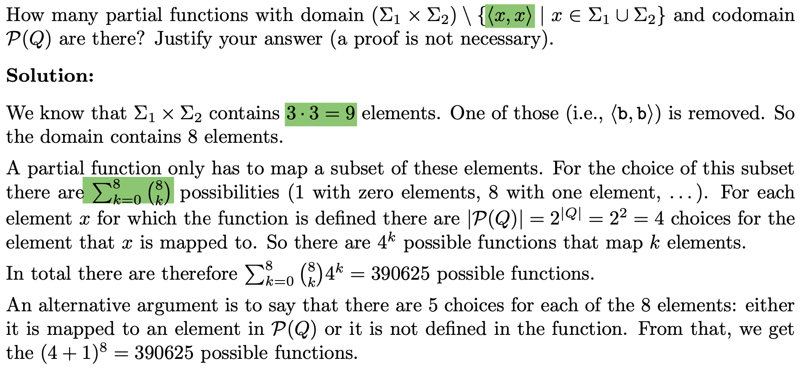

# 1. exercise 1
## 1.1 set, partial functions
 
## 1.2 Structural Induction

## 2.1 Regular Grammar
### how to elimite start variable from the right side of the rule:
1. add new rules which replacing all occurences of S in r with S′ 
2. add new rule: for S -> w replace S with S' in w.
### how to eliminate forbidden A -> ε
1. check S not occur in right side
2. find variable can derived to ε -> Vε
3. eliminate forbidden ε rule: 
4. If a variable from Vε occurs in the right-hand side, add another rule that directly emulates a subsequent replacement with the empty word: X → a and Y → b
